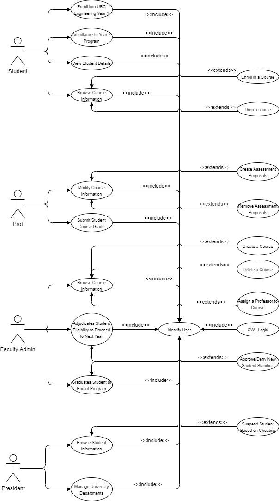
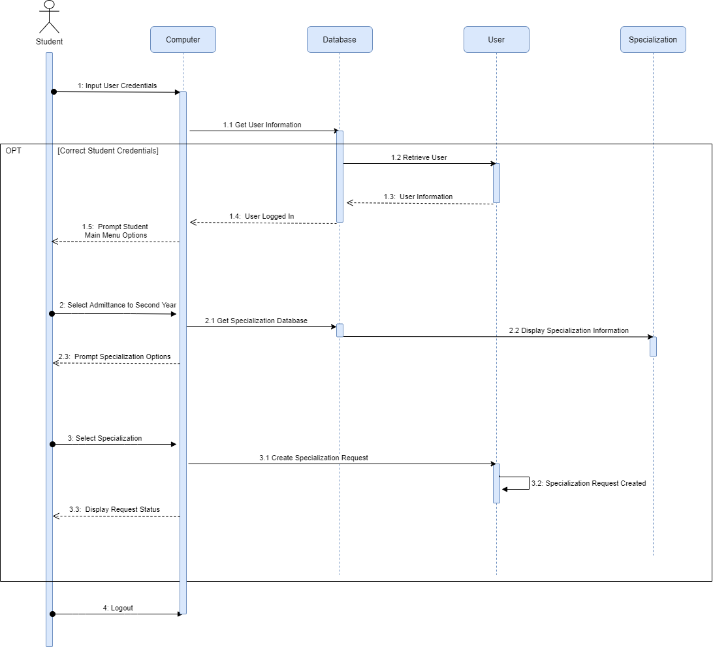
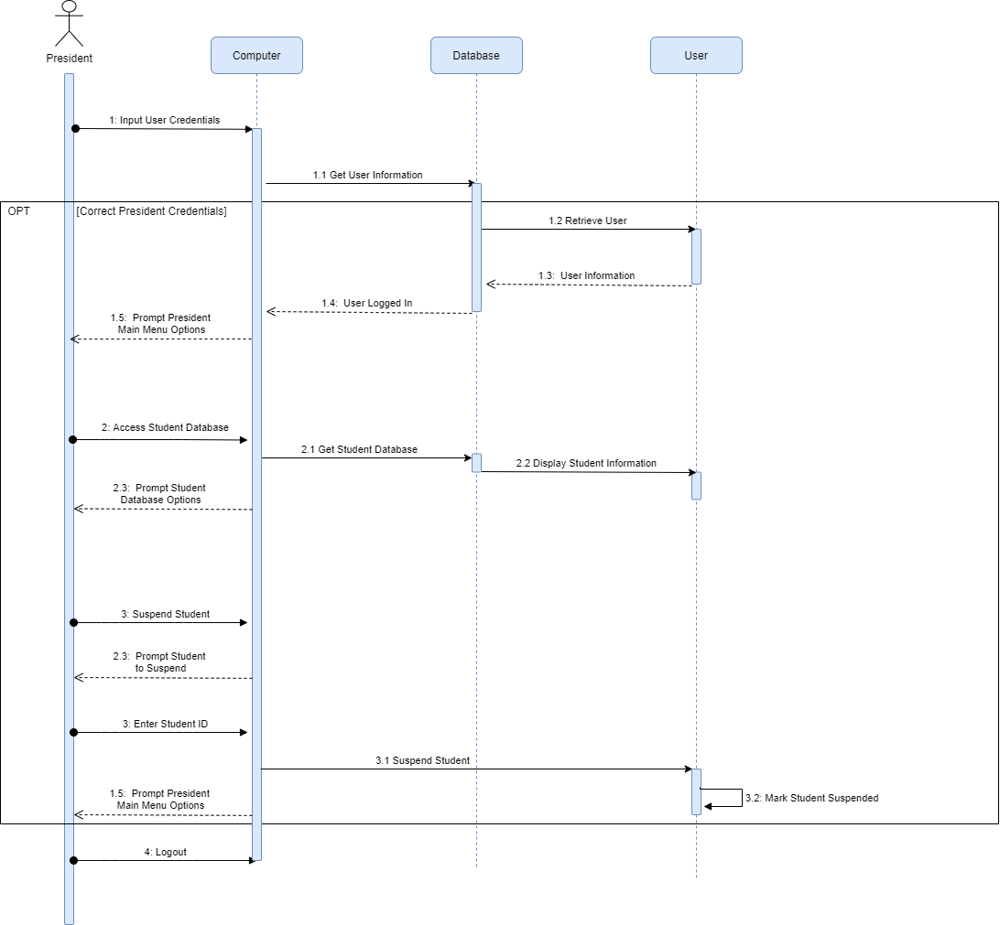
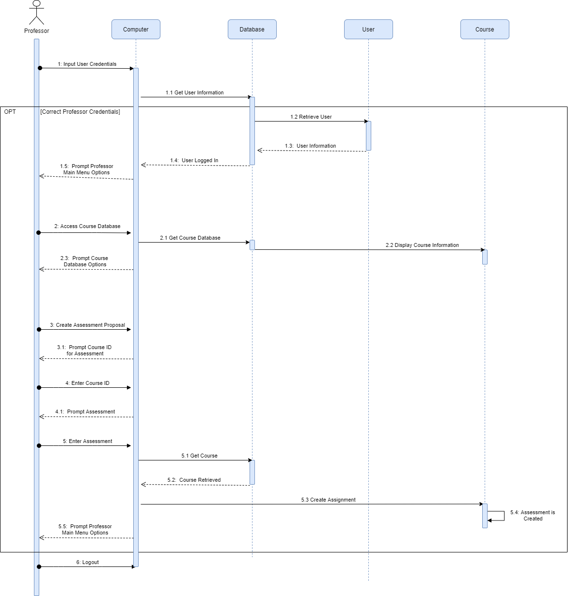
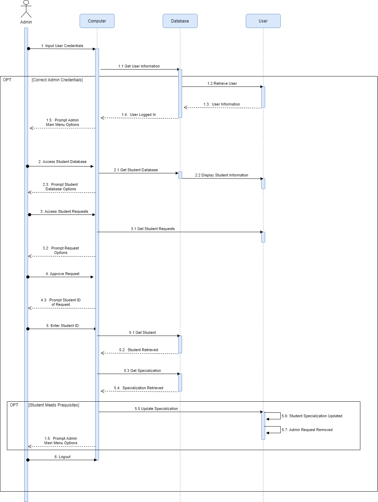
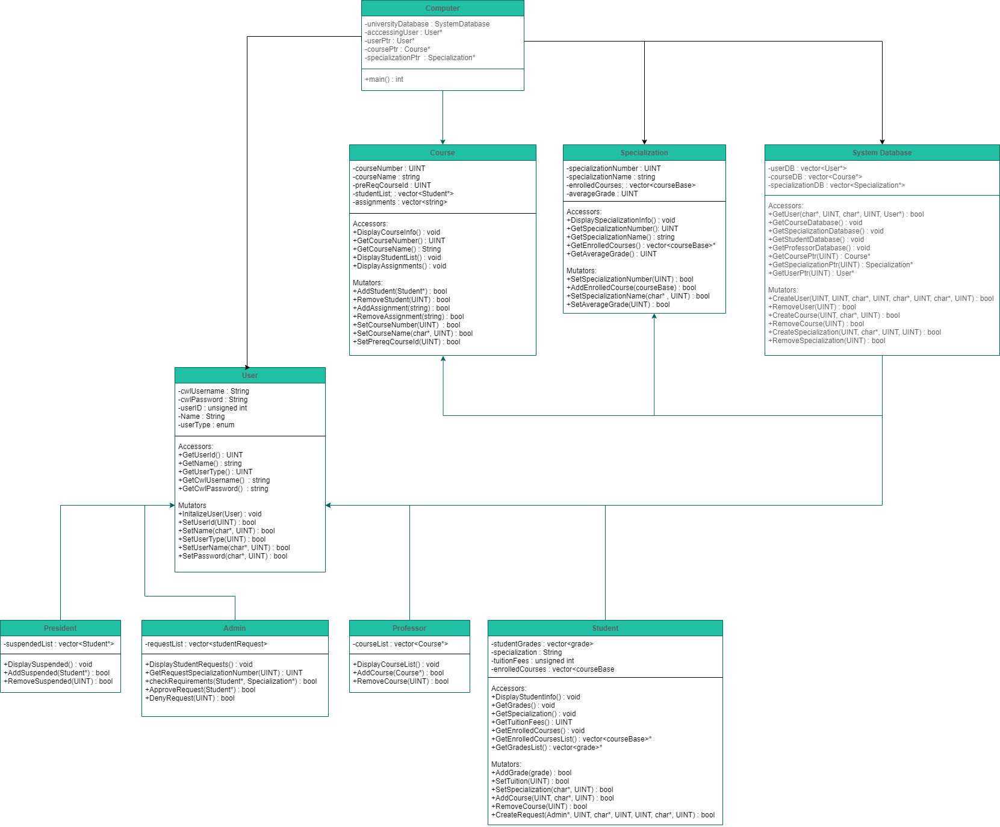

# University-System-Database
University of British Columbia  
System Software Engineering (CPEN)  

- Isabelle Andre
- Justin Chang

A mock cmd line University System and non-persistent database for engineering professors and student courses, grades, enrollment, applications, etc.
Computerizes traditional paper-records or spreadsheet approach of running a University such as UBC.
Every Actor (Student, Professor, Admin, President) inherit user properties, and possess a userID, username, and password to Login.

### Actors
#### Student
* Displays Student Info, Grades, Specialization, Tuition Fees, Enrolled Courses
* Can Add Course Grade, Tuition Fee, Set a Specialization, Add/Remove Courses, Submit a Specialization Request to Admin

#### Professor
* Displays Teaching Course List
* Can Add/Remove Teaching Course

#### Admin
* Displays Student Specialization Requests, Checks that Student Possesses Prereq Grades and Courses for Specialization
* Can Approve/Deny Student Specialization Request

#### President
* Displays Suspended Students List
* Can Suspended/Unsuspend Student

### Other Classes
#### Course
* Displays Course Info, Enrolled Students, Course Assignments
* Can Enroll/Remove Student, Add/Remove Assignment, Set Course Name, Code, and Prereq Courses

#### Specialization
* Displays Specialization Info, Prereq Courses and Grades
* Can Add Prereq Courses and Grades

### System Database
* Can Display Entire Course List, Specialization List, Student List, Professor List
* Can Create/Remove User, Course, Specialization

## User Case Diagram:
* Actors: Student, Professor, Admin, President

## Sequence Diagrams:
* Use Cases:
	* Student Admittance into 2nd Year Progam
	* President Suspends Student Based on Academic Misconduct
	* Professor Creates New Assignment Proposal
	* Admin Approves/Denies Student Specialization Request

## Class Diagram:

#### Mock CWL Login Credentials for testing:
Student: - username: *user1* - password: *password1*  
Professor: - username: *professor* - password: *password*  
Admin - username: *admin* - password: *password*  
President: - username: *president* - password: *password*  
